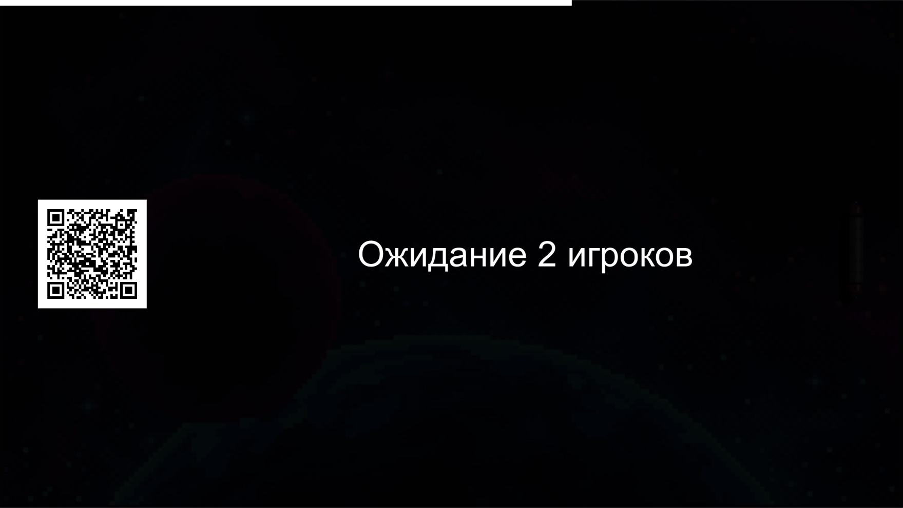
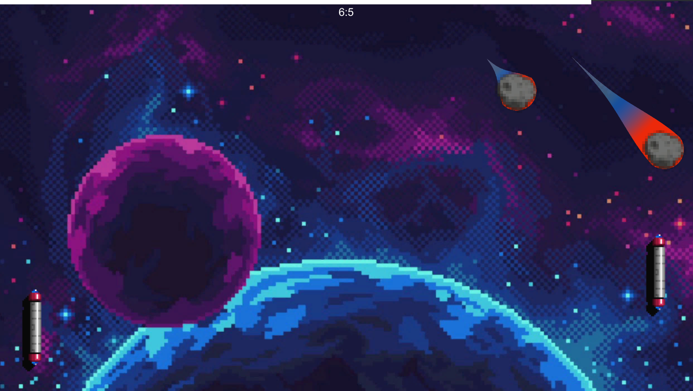
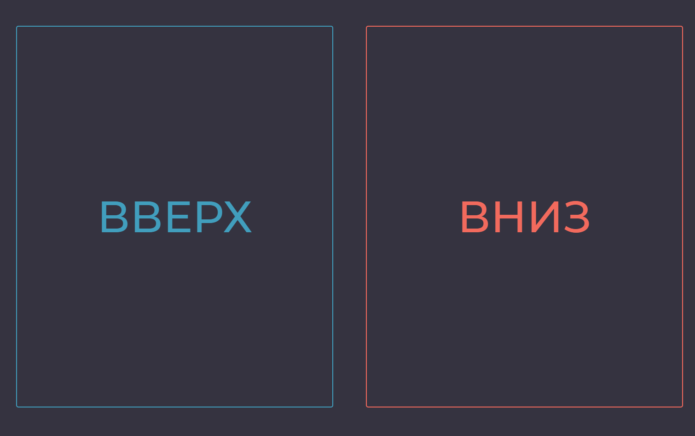

# Title
ArkoPong

---

# Description

		Помните PONG - одну из первых видеоигр, созданных человеком? Теперь у Вас есть возможность сыграть в неё прямо на большом экране института ИТ в РТУ МИРЭА. И это не всем привычная классика. Здесь Вы можете сыграть сразу двумя шарами, прочувствовать азарт от борьбы с реальным человеком и погрузиться в космическую атмосферу. Всё, что нужно: отканировать QR-код на своём телефоне, перейти по полученной ссылке, дождаться соперника и выигрывать.
---

# Images
* 
* 
* 
---

# Videos

---

# Tags
* Backend
* Unity
---
# Tech
* Unity
* C#
* ASP.NET Core 
* SignalR
---
# Developers
* Корчиков М.Д.
* Лаптев И.А.
* Шошников И.К.
---
# Site

---
# SourceCode
| name                         | link                                                |
| ---------------------------- | --------------------------------------------------- |
| Backend                      | https://github.com/RTUITLab/Screen-ArkoPong-Back    |
| Unity                        | https://github.com/RTUITLab/Screen-ArkoPong-Unity   |

---